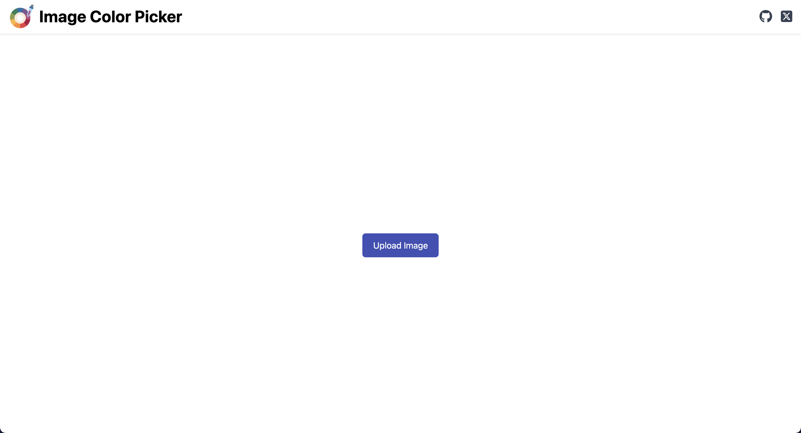
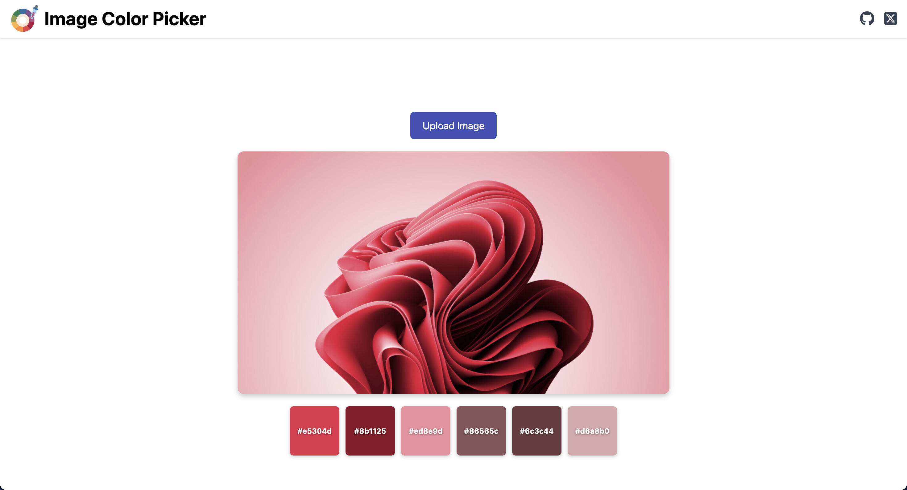
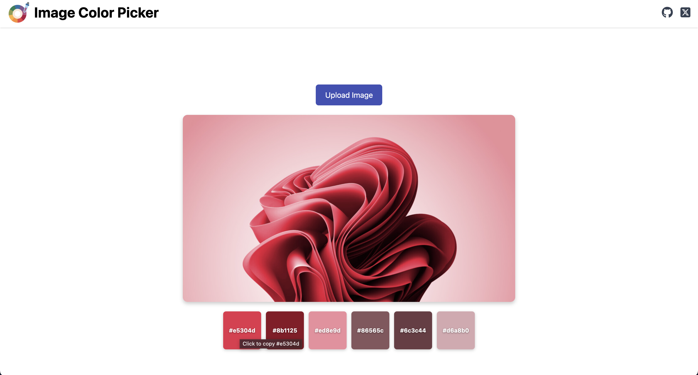

# Image Color Picker

A sleek and responsive web app to extract and display dominant colors from any image using modern web technologies.

It lets: 
- Upload an image
- Display the uploaded image
- Extract the top dominant colors using `node-vibrant/browser`
- Show the dominant colors as swatches
- Copy any color's HEX code to clipboard by clicking on it





## Tech Stack
**Frontend:** React, TypeScript
**Color Extraction:** node-vibrant

## How It Works?
This project uses node-vibrant, a JavaScript library that extracts prominent colors from images. It applies image quantization—typically reducing the image to 64 representative colors—to enhance color extraction accuracy and returns 6 key color swatches.

It extracts prominent colors (usually 6 swatches by default):
- Vibrant
- Muted
- DarkVibrant
- DarkMuted
- LightVibrant
- LightMuted

It uses image quantization via the MMCQ algorithm (Modified Median Cut Quantization), reducing the image to a limited palette (default around 64 colors) for analysis.

The output includes both the RGB values and the population (i.e. frequency) of each swatch.

## Getting Started
```bash
git clone 
cd image-color-picker
npm install
npm run dev
```

## Contributing
Contributions are welcome! If you have suggestions for improvements, new features, or bug fixes, feel free to fork the repo and submit a pull request.

Steps to Contribute:
1. Fork the repository
2. Create a new branch: ``` git checkout -b feature/your-feature-name ```
3. Make your changes and Commit your changes: ``` git commit -m "Add your message here" ```
4. Push to your fork: ``` git push origin feature/your-feature-name ```
5. Submit a pull request

Please make sure your changes follow the existing code style and include relevant documentation or comments.

## Future Work
**Add Dark Mode:** Enhance the UI with a dark theme toggle for better user experience in low-light environments.

## License
This project is open source and available under the [MIT License](LICENSE).

## Support
For questions, issues, or suggestions:
- Open an issue on GitHub
- Check existing issues before creating new ones
- Provide detailed information for bug reports

## Built By

- Twitter: [@Aritra_C1](https://x.com/Aritra_C1)
- GitHub: [@AritraC1](https://github.com/AritraC1)

If you like this project, consider giving it a ⭐️ on GitHub and sharing it with others!